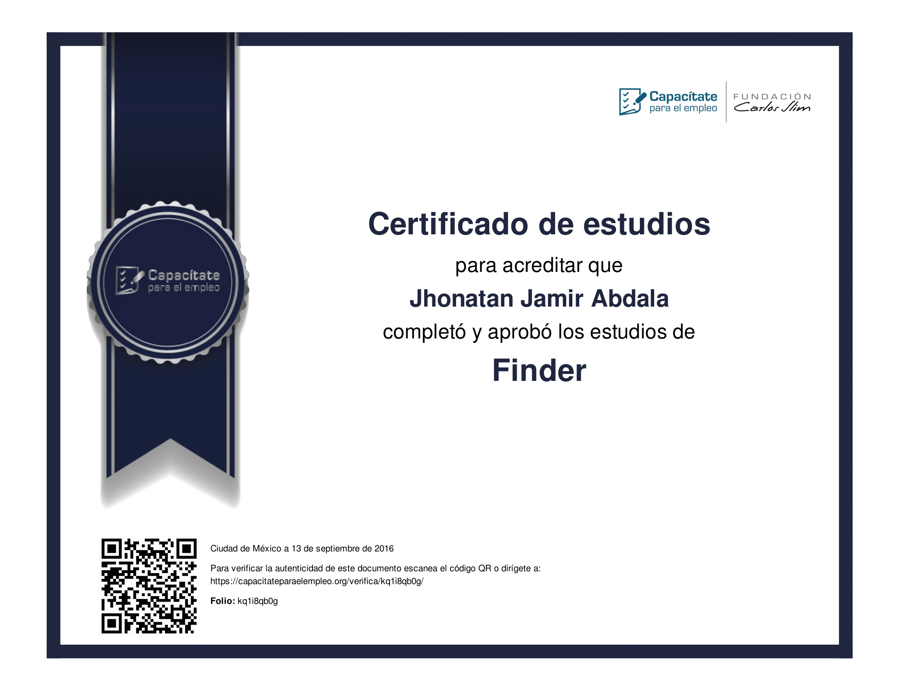
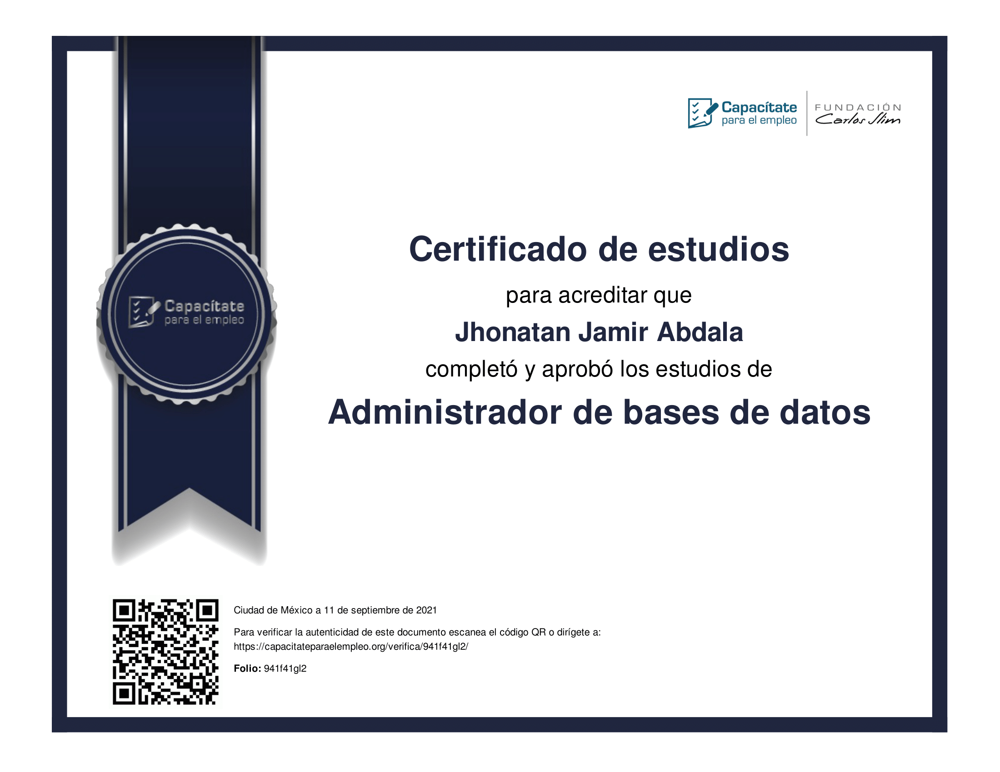
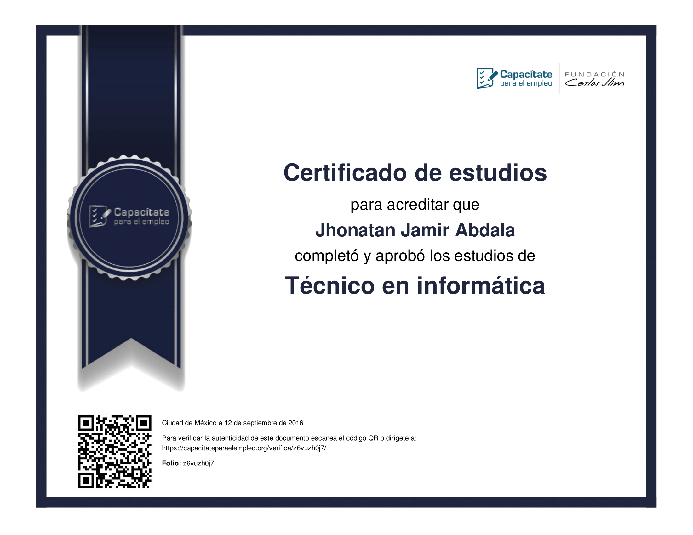

# Certificates

  
FreeCodeCamp Certificates

[FrontEnd development libraries](https://www.freecodecamp.org/certification/lazyneil/front-end-development-libraries)

[Javascript algorithms and data structures](https://www.freecodecamp.org/certification/lazyneil/javascript-algorithms-and-data-structures)

[Responsive WEB design](https://www.freecodecamp.org/certification/lazyneil/responsive-web-design)

  
Carlos Slim Fundation Certificates

